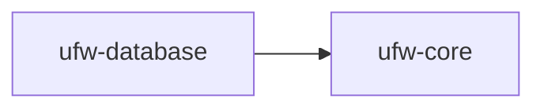

# Database: Introduction

The Database component is the most central, after the Core component, since it provides all the
database connectivity utilities used by most other components. It does not depend on any database libraries except for
JDBC.

Among other things:

* The `TypedQuery` classes, used to define SQL queries that can later be used in a type-safe manner.
* The `Database` class, used to execute `TypedQuery`s.
* The `UnitOfWorkFactory` and `UnitOfWork` interfaces, used to bundle multiple queries into a transaction.
    * Many of the other components, such as the [Job Queue](../job-queue), provide instances of `UnitOfWork` when interacting with user code.
* The `DatabaseLocks` interfaces, used to get handles to database-backed exclusive locks.

For more details:

1. See [Installation](./installation.md) for setup instructions
2. See [Usage](./usage.md) for usage instructions

!!! warning

    Currently, only PostgreSQL databases are supported.

## Dependencies

