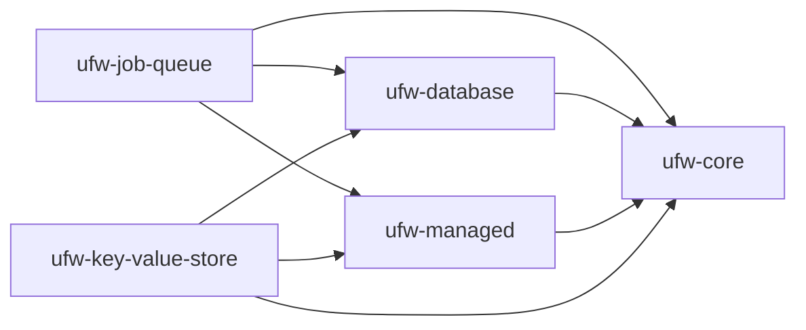

# Components

[ufw-core](./core)
: Provides the basic utilities used by all the other components.

[ufw-database](./database)
: Provides interfaces to the database used by the rest of the components.

[ufw-managed](./managed)
: Manages the life-cycle of `Managed` objects.

[ufw-job-queue](./job-queue)
: The Job Queue component is simple database-backed job queue.

# Dependency Relationships

