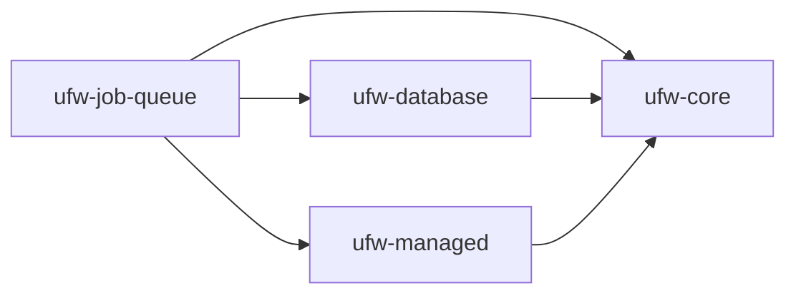

# Job Queue: Introduction

The Job Queue component is simple database-backed job queue. It allows you to schedule asynchronous tasks easily with
transactional safety using the `UnitOfWork` interface from the [Database component](../database) 

1. See [Installation](./installation.md) for setup instructions
2. See [Usage](./usage.md) for usage instructions

## Dependencies

