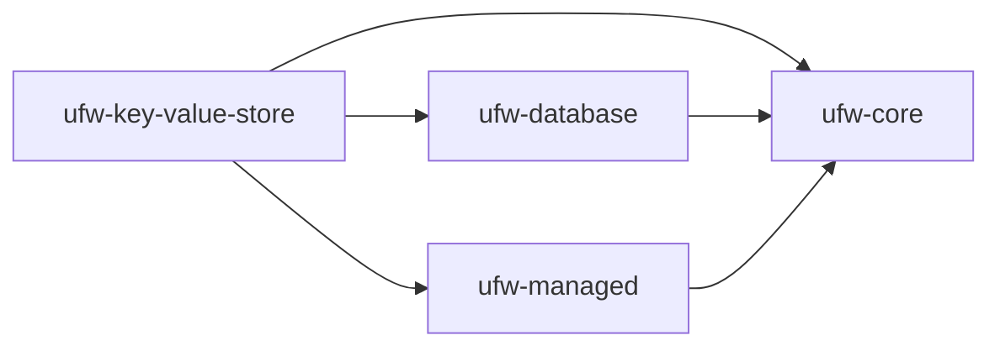

# Key-Value Store: Introduction

The Key-Value Store component provides a simple database backed storage mechanism. It allows for database storage
without needing to create additional database tables in situations where simple key-based retrieval is sufficient.

The Key-Value Store supports versioning and can be used within a `UnitOfWork`.

Entries in the Key-Value Store may also be expired using an optional TTL value set when writing the entry.

Common use-cases include caching and small document storage.

For more details:

1. See [Installation](./installation.md) for setup instructions
2. See [Usage](./usage.md) for usage instructions

## Dependencies

