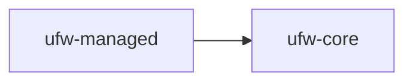

# Managed: Introduction

The Managed component is responsible for managing the life-cycle of application objects. All registered instances will
automatically started and stopped collectively on application start-up and shutdown. When using the Guice module, all
`Managed`-derived will be registered automatically.

The Managed component is used by several of the other components to handle the life-cycles of their background
activities.

For more details:

1. See [Installation](./installation.md) for setup instructions
2. See [Usage](./usage.md) for usage instructions

## Dependencies

