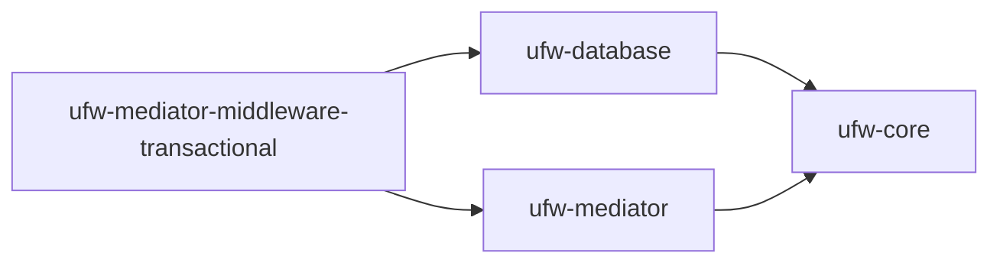

# Mediator: Introduction

The Mediator is an abstraction to decouple your application code from the particular framework that you're using.

Rather than having all your application code inside of wide controller classes, the Mediator allows you to define
domain-relevant Commands and Queries, and implement handlers for them separately. The Mediator also supports middleware
in it's processing pipeline that can be used to handle cross-cutting concerns like caching, logging, retries, time
limits and transactions.

For more details:

1. See [Installation](./installation.md) for setup instructions
2. See [Usage](./usage.md) for usage instructions

## Dependencies

